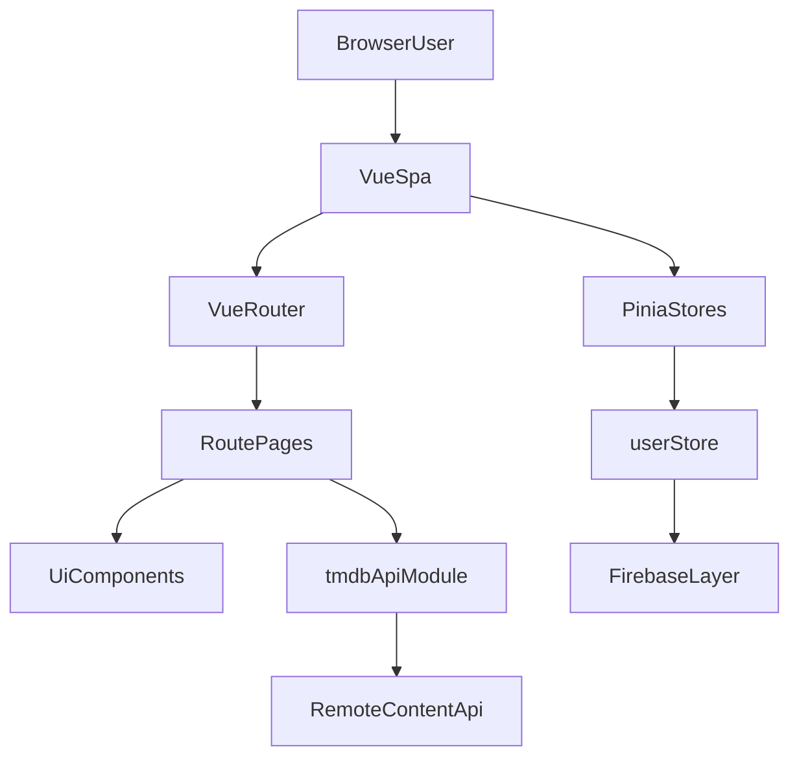

# Notflix Project Overview

## Overview

Notflix is a Netflix-style streaming UI clone built as a Vue single-page application. The product focuses on a polished browsing experience for movies and TV shows, including a marketing landing page, sign-in and sign-up screens, profile selection, browsable content rows, search, detail modals, and a personal "My List" feature.

The current codebase behaves more like a frontend demo or educational clone than a full production streaming platform. It uses a remote title API for content metadata and is structured to support Firebase-backed auth and persistence, but the Firebase runtime is currently stubbed and the app defaults to a guest-style flow.

## Product Experience

The main user-facing flows in the current app are:

- Landing page with Netflix-style marketing copy and guest entry.
- Login and signup pages.
- Profile selection before browsing.
- Browse pages for home, TV, movies, latest, and my list.
- Search across titles.
- Content carousels and top-ten sections.
- Modal detail views for cast, related titles, and TV episodes.
- Embedded playback and trailer-oriented media surfaces.

Primary routes are defined in `src/router/router.js`:

- `/`
- `/signup`
- `/login`
- `/select-profile`
- `/browse`
- `/tv`
- `/movies`
- `/latest`
- `/my-list`
- `/search`

## Tech Stack

- Vue 3 for the application UI.
- Vite for local development and production builds.
- Vue Router for SPA navigation.
- Pinia for application state.
- Tailwind CSS v4 through the Vite plugin.
- Swiper for carousel-style content presentation.
- Vidstack for media player integration.
- Firebase SDK for intended auth and persistence integration.
- Plain JavaScript for most of the codebase, with very limited TypeScript usage.

## High-Level Architecture

Notflix is a client-rendered SPA. The app is mounted in the browser, uses route-based page components, and talks directly to external services from the frontend.



### App Layers

- `src/main.js`: bootstraps Vue, Pinia, and Vue Router, then triggers user-store initialization.
- `src/router/router.js`: defines public and auth-gated routes and runs a global navigation guard.
- `src/pages`: route-level screens such as landing, browse, search, auth, and profile selection.
- `src/components`: reusable UI building blocks including navigation, media rows, featured hero units, mobile variants, and content modals.
- `src/stores`: Pinia stores for user, movies, and TV state.
- `src/api/tmdb.js`: the main content-fetching module used by pages and stores.
- `src/firebase.js`: Firebase initialization layer.
- `vite.config.js`: build, alias, plugin, chunking, and dev-server configuration.

### Rendering Model

- The app is not server-rendered.
- Navigation uses `createWebHistory()`, so deployed environments must support SPA rewrites.
- `netlify.toml` already includes a catch-all redirect to `/index.html`.

## Runtime And Data Flow

### Bootstrap Flow

1. `src/main.js` creates the Vue app and registers Pinia and Router.
2. After mount, it calls `useUserStore().init()`.
3. The user store currently initializes a guest-like user immediately instead of waiting for real Firebase auth state.
4. Route guards in `src/router/router.js` also resolve to a guest-like user object, so auth-restricted routes are effectively reachable in the current implementation.

### Content Flow

The browse experience is driven primarily by `src/pages/Home.vue` and `src/api/tmdb.js`:

- Page components request categorized content through dedicated fetch helpers.
- Fetch helpers call a remote API hosted at `https://imdb.6683549.xyz`.
- API responses are normalized into TMDB-like objects by helper code such as `imdbToTmdb()`.
- The home page builds multiple grids such as new releases, top ten, trending TV, and genre-based rows.
- Selected content opens a modal that fetches richer details, related titles, and episodes.

### User/Profile Flow

The intended design is Firebase Auth plus Firestore-backed profile and list management, but the current behavior is different:

- `src/firebase.js` reads Firebase env vars and initializes the app.
- `auth` and `db` are currently exported as `null`.
- `src/stores/user.js` short-circuits into a guest user and guest profiles before real Firebase logic runs.
- Several Firestore-backed methods still exist in the store, but they are not active in the default execution path.

## External Services

### Remote Content API

The frontend fetches content directly from:

- `https://imdb.6683549.xyz`

This API is used for:

- Trending movies and TV shows.
- Genre-based lists.
- Title details.
- Seasons and episodes.
- Search.
- Similar-content recommendations.

Although the file is named `src/api/tmdb.js` and `VITE_TMDB_API_KEY` still exists, the current implementation is not a straightforward TMDB-only integration. It uses a TMDB-like shape on top of a separate remote service.

### Firebase

Firebase is still present as an architectural dependency:

- Auth and Firestore imports remain in the code.
- The store contains sign-up, sign-in, guest sign-in, profile, and my-list methods designed for Firebase.
- The runtime is currently disabled because `auth` and `db` are set to `null`.

## Directory Guide

- `src/pages`: route-level screens.
- `src/components`: reusable UI and media presentation.
- `src/stores`: application state.
- `src/api`: content-fetching and normalization.
- `src/composables`: reusable frontend logic.
- `src/utils`: helper utilities.
- `public` and top-level static assets: logos, hero imagery, avatars, and other static resources.
- `vite.plugins`: custom Vite plugin code, including avatar directory handling.

## Local Development

### Prerequisites

- Node.js 16 or newer according to the README.
- npm 7 or newer according to the README.
- In practice, `netlify.toml` pins Node 18 for hosted builds.

### Install

```bash
npm install
```

### Run The Dev Server

```bash
npm run dev
```

This starts Vite in development mode.

### Build For Production

```bash
npm run build
```

This runs `vite build`.

### Preview The Production Build

```bash
npm run preview
```

This runs `vite preview`.

### Commands Not Present

The current `package.json` does not define scripts for:

- tests
- linting
- formatting

No obvious test framework or test suite is present in the repo at the moment.

## Environment Variables

### Documented In `.env.example`

```bash
VITE_TMDB_API_KEY=YOUR_API_KEY_HERE
```

### Referenced By The Current Code

`src/firebase.js` expects these additional variables:

```bash
VITE_FIREBASE_API_KEY=
VITE_FIREBASE_AUTH_DOMAIN=
VITE_FIREBASE_PROJECT_ID=
VITE_FIREBASE_STORAGE_BUCKET=
VITE_FIREBASE_MESSAGING_SENDER_ID=
VITE_FIREBASE_APP_ID=
```

### Important Note

There is a mismatch between the checked-in env example and the current code:

- `.env.example` only documents the TMDB key.
- `src/firebase.js` expects multiple Firebase `VITE_` variables.
- Because Firebase is currently stubbed at runtime, some local flows still work without a real Firebase setup, especially guest-oriented browsing.

## Build And Deployment Notes

The repo contains explicit Netlify deployment configuration in `netlify.toml`:

- publish directory: `dist`
- build command: `npm run build`
- SPA rewrite from `/*` to `/index.html`
- Node version: `18`
- security headers for all routes and long-lived caching headers for `/assets/*`

This matters because the README still says the project was deployed on a Linux server with Apache. For current onboarding, the codebase itself points more clearly to Netlify-style static SPA deployment.

## Notable Implementation Details

### Vite Configuration

`vite.config.js` includes a few useful details:

- `@` resolves to `src`.
- Tailwind is wired through `@tailwindcss/vite`.
- Vidstack is enabled through its Vite plugin.
- A custom local plugin named `avatarDirectoryPlugin` is loaded from `vite.plugins/avatarDirectory`.
- Production builds drop `console` statements.
- Rollup manual chunking groups `vue` and `vue-router` into a `vendor` chunk.
- The dev server sets a permissive `Content-Security-Policy` frame source header.

### State Management

Pinia is the main active store library. `vuex` still exists in dependencies, but the visible app state work is centered around Pinia stores such as:

- `useUserStore`
- `useMovieStore`
- `useTVStore`

## Known Caveats And Mismatches

- The project presents login/signup/profile features, but current auth behavior is effectively guest-first because Firebase auth is stubbed.
- Firestore-backed methods remain in the user store, but `auth` and `db` are currently `null`.
- The README describes TMDB and Firebase setup, but the runtime content source is primarily `https://imdb.6683549.xyz`.
- The README deployment story and the repository deployment config do not fully match.
- Some code paths in stores and API helpers appear transitional or partially migrated.
- There is no formal automated test, lint, or formatting workflow configured in `package.json`.

## Onboarding Summary

If you are new to this repo, the safest mental model is:

1. This is a Vue 3 + Vite Netflix-style frontend clone.
2. It is currently a client-only app that fetches content from a remote title API.
3. Firebase integration exists in structure, but not as the active runtime path.
4. `npm run dev`, `npm run build`, and `npm run preview` are the main supported local commands.
5. When documentation and code disagree, trust the current implementation first.
